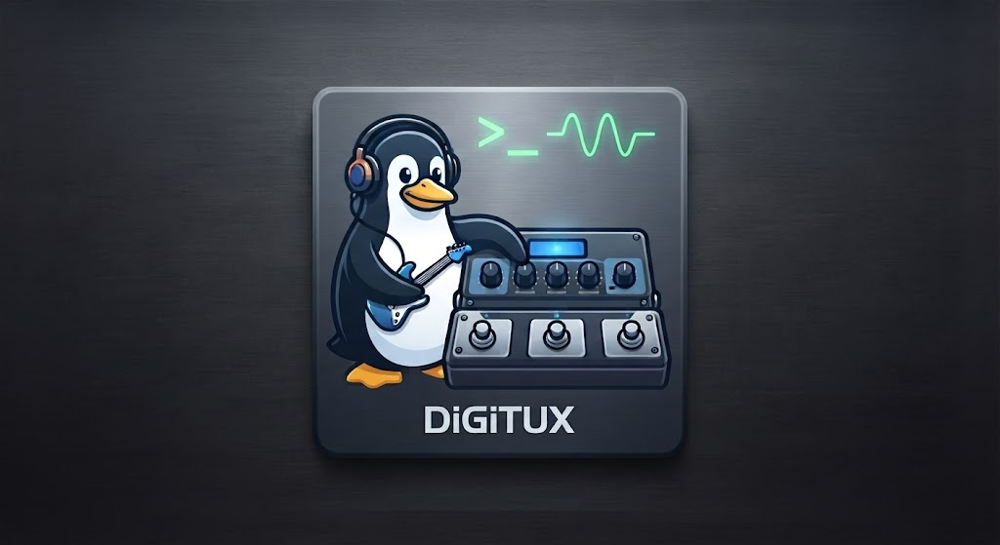
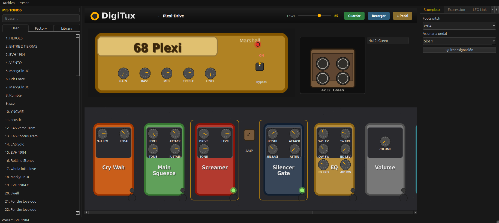

# DigiTux v2



Editor para **DigiTech RP360 / RP360XP** en Linux, con **gráficos propios
caricaturizados** (libres de material con copyright).



Esta es la versión apta para publicar en GitHub: el backend y las reglas del
dispositivo se deducen por ingeniería inversa (protocolo serie JSON), y todas las
imágenes son **arte derivado original** en estilo *cartoon plano* (contorno +
colores planos), no las fotos oficiales.

## De dónde viene

La estructura del efecto/cadena y el protocolo se dedujeron estudiando el
comportamiento del hardware (dumps serie) y el formato de preset. Las imágenes
originales no se incluyen; en su lugar se generaron **caricaturas** que conservan
tamaño y silueta de cada pedal/amplificador/caja, reduciendo las fotos a unos
pocos colores planos con contorno.

## Características

- Pedales con knobs en coordenadas exactas (filmstrips de 99 frames).
- Amplificador con knobs dentro, LED + interruptor de palanca ON/Bypass, cabinet.
- Pedalboard con 10 posiciones de cadena, huecos vacíos, amp como pin arrastrable
  y **drag-and-drop para reordenar**.
- Selector gráfico contextual de efectos (una categoría por posición).
- Panel de control: Stompbox, Expression Link, LFO Link, Wah Settings.
- Preset Level, menú (Backup/Restore/Import/Export/Store New/Quick Store/Copy).
- Pestañas User / Factory / Library (99 presets).

## Instalación

Elige el formato que te convenga (release en [Releases](https://github.com/IlicaJ/digitux/releases)):

| Formato | Archivo | Para quién |
|---|---|---|
| **Binario** | `digitux-x86_64` | Linux x86_64 sin instalar nada (ejecutar directamente) |
| **AppImage** | `DigiTux-x86_64.AppImage` | Archivo único portable |
| **.deb** | `digitux_0.2.0-1_all.deb` | Ubuntu / Debian / Mint (`sudo apt install ./digitux_...deb`) |
| **pip** | `pip install .` | Desarrolladores / usuarios de pip |

Binario y AppImage: `chmod +x` y ejecutar. El `.deb` instala la regla udev
(`/etc/udev/rules.d/99-rp360.rules`) y el acceso directo al menú automáticamente.

```bash
# vía pip (desde el repo)
pip install .
digitux

# o desde el código fuente
pip install pyserial PyQt5
python3 -m nexus.ui.main

# o con el lanzador incluido
./run.sh
```

Requiere el RP360 conectado (`1210:0032` / `/dev/ttyACM0`) y una regla udev que
dé acceso al puerto serie (p. ej. `/etc/udev/rules.d/99-rp360.rules`).

```udev
SUBSYSTEM=="tty", ATTRS{idVendor}=="1210", ATTRS{idProduct}=="0032", MODE="0666"
```

## Estructura

```
nexus/
  transport.py  protocol.py  device.py  model.py  effects_db.py   # backend
  rp360_effects.json                                              # DB de efectos
  assets/img/  (pedals, amps, cabs, filmstrips, pedalboard)       # arte generado
  ui/  (main_window, pedal_widget, pedalboard_view, amp_cab_block,
        effect_picker, control_panel, knob, main)
data/nexus_factory_presets.json
generate_assets.py  # regenrador de los gráficos (PIL)
```

## Apoyar el proyecto

[](https://buymeacoffee.com/lica)

## Licencia

GPL-3.0 — ver el archivo `LICENSE`.

## Nota legal

"DigiTech", "Nexus" y "RP360" son marcas de Harman International, usadas solo
con fines de identificación e interoperabilidad. Este proyecto **no está
afiliado ni respaldado** por DigiTech/Harman.

Todo el material gráfico es **generado por código** (`generate_assets.py`) en
estilo *cartoon plano*: no incluye fotos ni ilustraciones propietarias. Los
nombres de efectos/amplificadores se han normalizado a descriptores genéricos
(sin uso de marcas registradas).